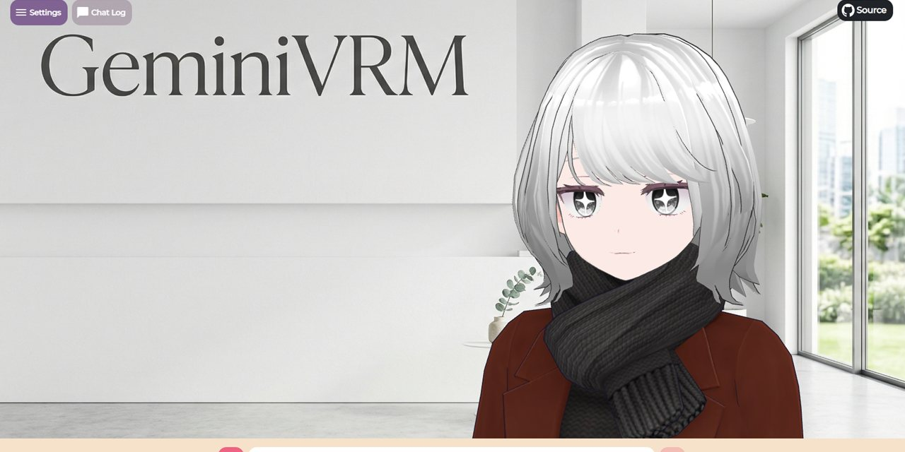

<div align="center">
  
  <h1>GeminiVRM</h1>
  <p>Gemini Live ネイティブ音声で動く、ブラウザ完結の VRM チャットアプリです。</p>
  <p>
    <a href="https://github.com/Sunwood-ai-labs/GeminiVRM/actions/workflows/ci.yml"></a>
    <a href="./LICENSE"></a>
    
    
    
  </p>
  <p>
    <strong>Languages</strong><br />
    <a href="./README.md">English</a> |
    <a href="./README.ja.md">日本語</a>
  </p>
</div>

## ✨ 概要

GeminiVRM は [`pixiv/ChatVRM`](https://github.com/pixiv/ChatVRM) をベースに、旧 OpenAI + Koeiromap 経路を Gemini Live ネイティブ音声へ置き換えた公開向けビルドです。ブラウザ上で VRM アバターと会話する体験はそのままに、応答音声のレイテンシを小さくしています。

現在のビルドでは、次の点を重視しています。

- 応答完了待ちではなく、Gemini Live の音声 chunk 到着ごとに順次再生
- `public/Kiyoka.vrm` を既定モデルとして同梱
- Gemini の voice preset、model、system prompt を UI から調整可能

## ✨ 主な機能

- Gemini Live の transcript と audio をブラウザでストリーミング
- `public/Kiyoka.vrm` ですぐに開始、任意の `.vrm` 読み込みにも対応
- live model、voice preset、system prompt を設定画面から変更可能
- 既存の VRM 口パクパイプラインを chunked PCM 再生へ最適化
- Playwright の軽量 smoke E2E を同梱
- GitHub Pages 向け静的デプロイに対応

## 🧱 技術スタック

- Next.js 15
- React 18
- `@google/genai`
- `@pixiv/three-vrm`
- TypeScript
- Tailwind CSS
- Playwright

## 🚀 セットアップ

```bash
npm install
npm run dev -- --hostname 127.0.0.1 --port 3100
```

[http://127.0.0.1:3100](http://127.0.0.1:3100) を開き、[Google AI Studio](https://aistudio.google.com/apikey) で発行した Gemini API key を入力して `Start` を押してください。

アプリと docs を同時に起動する場合は:

```bash
npm run dev:all
```

アプリは `http://127.0.0.1:3100`、docs は `http://127.0.0.1:4173` で確認できます。

## 🔐 環境変数

[.env.example](./.env.example) を参照してください。

- `NEXT_PUBLIC_GEMINI_API_KEY`
  - ローカル利用時にブラウザへ初期表示する API key
- `BASE_PATH`
  - GitHub Pages やサブパス配信時のプレフィックス
- `NEXT_PUBLIC_GEMINI_LIVE_MODEL`
  - UI に初期表示する live model
- `NEXT_PUBLIC_GEMINI_LIVE_VOICE`
  - UI に初期表示する Gemini の prebuilt voice 名

既定 preview alias が使えない場合は、次の model を試してください。

```text
gemini-2.5-flash-native-audio-preview-12-2025
```

## 🕹️ 使い方

1. アプリ起動後に Gemini API key を入力します。
2. 既定の `Kiyoka.vrm` を使うか、`Settings` から別の VRM を読み込みます。
3. テキスト送信またはマイク入力で会話します。
4. 必要に応じて model、voice、system prompt を調整します。

## 🏗️ リポジトリ構成

```text
public/                     VRM、画像、OGP などの静的アセット
scripts/e2e-smoke.mjs       軽量ブラウザ smoke テスト
src/components/             UI コンポーネント
src/features/chat/          Gemini Live 接続と設定
src/features/lipSync/       音声再生と解析
src/features/vrmViewer/     Viewer と model ランタイム
docs/                       設計・デプロイ・QA ドキュメント
```

## 📚 ドキュメント

- Live docs (English): [https://sunwood-ai-labs.github.io/GeminiVRM/docs/](https://sunwood-ai-labs.github.io/GeminiVRM/docs/)
- Live docs (Japanese): [https://sunwood-ai-labs.github.io/GeminiVRM/docs/ja/](https://sunwood-ai-labs.github.io/GeminiVRM/docs/ja/)
- [開始手順](./docs/ja/getting-started.md)
- [使い方](./docs/ja/usage.md)
- [Architecture notes](./docs/ja/architecture.md)
- [Deployment guide](./docs/ja/deployment.md)
- [トラブルシュート](./docs/ja/troubleshooting.md)
- [Repository QA inventory](./docs/ja/repository-qa-inventory.md)

ローカル docs 用コマンド:

```bash
npm run docs:build
npm run docs:preview
```

## 🧪 検証

```bash
npm run verify
```

個別に実行する場合は:

```bash
npm run lint
npm run build
npm run docs:build
npm run build:pages
npm run e2e:smoke
```

smoke E2E では、アプリ起動、送信導線、既知の chunk/icon/fallback 系エラーの不在を確認します。Gemini API key がない環境では、missing-key エラー表示も合格扱いです。

## 🌐 デプロイ

このリポジトリは GitHub Actions 経由の GitHub Pages 配信を前提に整備しています。

- `BASE_PATH` を使ったサブパス配信
- `NEXT_EXPORT=true` による Pages 向け静的 build
- Pages artifact は `.next-pages` から upload
- push / pull request ごとの lint・build・smoke E2E 実行

詳細は [docs/ja/deployment.md](./docs/ja/deployment.md) を参照してください。

## ⚠️ セキュリティ注意

- 現状は元の ChatVRM と同様に、Gemini API key をブラウザから直接利用します。
- 公開本番運用では、トークン中継やサーバー側での key 管理へ切り替えることを推奨します。

## 🙏 謝辞

- [`pixiv/ChatVRM`](https://github.com/pixiv/ChatVRM)
- [`@pixiv/three-vrm`](https://github.com/pixiv/three-vrm)
- [Gemini Live API](https://ai.google.dev/gemini-api/docs/live-api)
- [`@google/genai`](https://www.npmjs.com/package/@google/genai)
